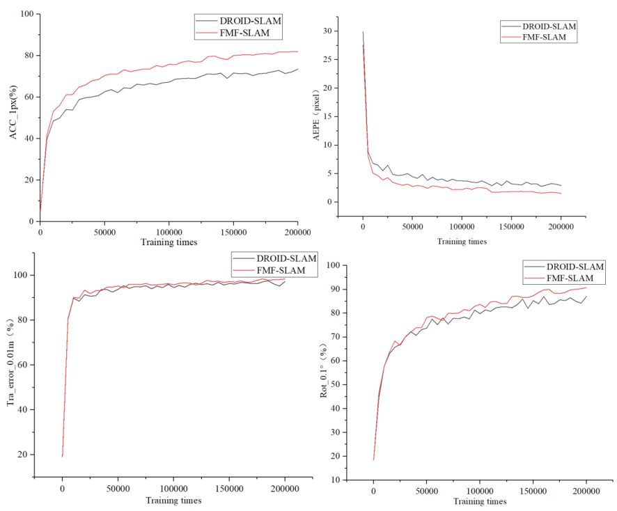

# Multimodal Fusion SLAM with Fourier Attention

Most visual SLAM systems perform poorly in challenging environments, such as noisy, light-changing, and dark conditions. Learning-based optical flow algorithms are effective in addressing challenges under these challenging conditions by utilizing multi modalities. However, the integration of state-of-the-art optical flow algorithms into visual SLAM is difficult due to the significant computational costs. To address the problem of visual SLAM in such challenging conditions, we propose FMF-SLAM, a fast multimodal fusion SLAM based on the fast Fourier transform. We first propose novel Fourier-based self-attention and cross-attention mechanisms to extract informative features efficiently and effectively from RGB and depth information within a two-branch encoder. Secondly, we enhance the interaction by incorporating multiscale knowledge distillation between the two modalities. Thirdly, we also integrate FMF-SLAM into the robot by fusing GNSS-RTK with a global Bundle Adjustment fusion method, which jointly optimizes the camera poses in a single optimization problem. The novel fusion method helps to optimizes the pose based on deep learning under the constraints of optical flow. We validate FMF-SLAM by using challenging sequences from the TUM, TartanAir, and our real-world datasets, demonstrating state-of-the-art performance under noisy, light-changing, and dark conditions. The validation of the integration on the robot also demonstrates the localization and mapping performance of our FMF-SLAM in large-scale outdoor environments.

## Tested with
* Ubuntu 20.04
* Cuda 10.1
* pytorch=1.6.0
* torchvision=0.7.0
* cudatoolkit=10.1
## Installation 
conda env create -f environment.yaml

pip install evo --upgrade --no-binary evo

pip install gdown

python setup.py install

## Download dataset 
* TartanAir dataset: Please see (https://theairlab.org/tartanair-dataset/).
* TUM dataset: Please see (https://cvg.cit.tum.de/data/datasets/rgbd-dataset).
* Our datasets: Please see https://pan.baidu.com/s/1SIGRnB16ef6R3JlvQYmWxg. password:1234.
<blockquote>
We also conduct the experiments on our datasets, which are recorded with a RealSense L515 camera under various lighting conditions under indoor environments with a resolution of 640x480 pixels. Firstly, we record a dataset named Realtest-GT with ground truth in an indoor environment. The Realtest-GT dataset is composed of 6 sequences. Sequences 01-02, 03-04 and 05-06 are recorded under standard, light-changing, and dark conditions, respectively. Each sequence includes RGB and valid depth images, along with the camera's trajectory recorded by a laser tracker. The trajectory recorded by the laser tracker is regarded as the ground truth for the datasets due to the high precision of the laser tracker. Then we record a dataset named Realtest-Visual without ground truth. The Realtest-Visual dataset consists of three sequences with RGB and valid depth images, which are recorded under standard, light-changing, and dark conditions, respectively. All the sequences follow a circular path back to the starting point. 

The Realtest-GT and Realtest-Visual datasets enable us to rigorously test and analyze the effectiveness of our \fmname{} under various indoor conditions in real world, offering both quantitative metrics and qualitative insights. 

</blockquote>

## Training curve

## Acknowledgement
The overall code framework is adapted from RAFT. We thank the authors for the contribution.
