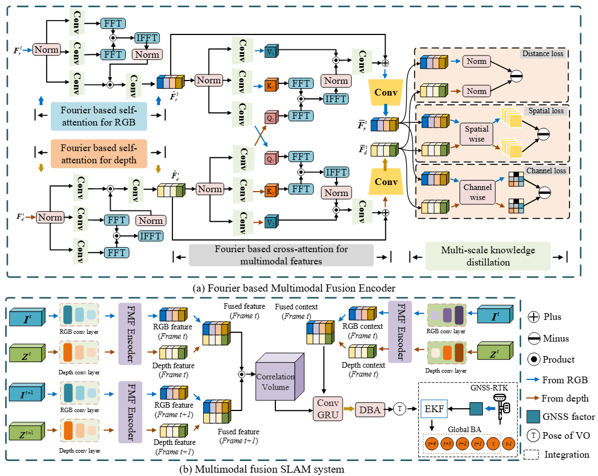

# Spatial-frequency Domain Transformed Optical and Scene Flow with Cross-Modal Knowledge Distillation

This paper studies the problem of multimodal fusion for optical and scene flow from RGB and depth images, or point clouds.
Previous methods fuse multimodal information in “early-fusion” or “late-fusion” strategies, in which attention mechanism is employed to address the problem of optical and scene flow estimation when RGB information is unreliable. Such attentive approaches either suffer from substantial computational and time complexities or lose the inherent characteristics of features due to downsampling.
To address this issue, we propose a novel multimodal fusion approach named SFRAFT, which utilizes Fourier transform to build the spatial-frequency domain transformed self-attention and cross-attention. With the novel attentive mechanism, our approach can extract informative features more efficiently and effectively. We further enhance information exchange between the two modalities by incorporating multi-scale knowledge distillation.Experimental results on Flythings3D and KITTI show that our SFRAFT achieves the best performance with low computational and time complexity. We also prove the strong ability of our approach for flow estimation on our real-world dataset.

## Tested with
* Ubuntu 20.04
* Cuda 10.1
* pytorch=1.6.0
* torchvision=0.7.0
* cudatoolkit=10.1
## Installation
SFRAFT requires our LieTorch package to be installed. Please see https://github.com/princeton-vl/lietorch for instructions (requires PyTorch >= 1.6). All Cuda kernels required for SFRAFT will automatically be installed with LieTorch.
## Download dataset 
* FlyingThings3D: Please see https://lmb.informatik.uni-freiburg.de/resources/datasets/SceneFlowDatasets.en.html.
* KITTI: Please see https://www.cvlibs.net/datasets/kitti/eval_scene_flow.php?benchmark=flow.
* Our datasets: Please see https://pan.baidu.com/s/1SIGRnB16ef6R3JlvQYmWxg. password:1234.
<blockquote>
We recorded a new indoor RGBD dataset using a Realsense D415 camera. This dataset features three lighting setups: Bright, Dimmed, and Dark. Each scenario is further divided into two splits: fast and slow motion. Each sequence contains two or more moving individuals and objects.
</blockquote>

## Acknowledgement
The overall code framework is adapted from RAFT. We thank the authors for the contribution.
